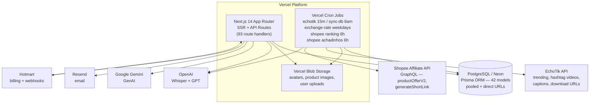

# System Architecture

> **Last updated**: 2026-08-06 (refresh — adds the Shopee vertical and the build-time migration change)

## System Overview

Hyppado is a **Next.js 14 monolith** deployed on **Vercel**. It uses the App Router architecture, where the frontend (React Server Components + Client Components) and backend (API Routes as serverless functions) live in the same codebase.

The system is data-driven and now ingests from **two independent marketplace sources**:

- **EchoTik** — TikTok Shop trending videos, products, and creators, refreshed every 15 minutes; also the source of hashtag video lists and native captions used by the Shopee achadinhos pipeline.
- **Shopee Affiliate Open API** — a GraphQL API used both to rebuild the Shopee best-seller ranking and to match TikTok videos to real, purchasable Shopee products with affiliate links.

Users interact with that data through a dashboard. AI features call external LLM APIs (OpenAI, Google Gemini) on demand and, for the achadinhos pipeline, from a scheduled cron job.

## Architecture Diagram



### Text Alternative

```
Vercel Platform
  +-- Next.js 14 App Router (SSR + 93 API route handlers)
  +-- Vercel Cron Jobs
  |     +-- /api/cron/echotik              every 15 minutes
  |     +-- /api/cron/sync-db              daily 06:00
  |     +-- /api/cron/exchange-rate        weekdays 16:30
  |     +-- /api/cron/shopee?task=ranking     every 6 hours
  |     +-- /api/cron/shopee?task=achadinhos  every 6 hours
  |     +-- /api/cron/transcribe           on demand (not in vercel.json)
  +-- Vercel Blob Storage (avatars, product images, user uploads)

Data store
  +-- PostgreSQL on Neon — Prisma ORM, 42 models, pooled + direct URLs

External services
  +-- EchoTik API        trending data, hashtag video lists, captions, download URLs
  +-- Shopee Affiliate   GraphQL productOfferV2 + generateShortLink
  +-- Hotmart            subscription billing, inbound webhooks
  +-- OpenAI             Whisper transcription, GPT insights and product extraction
  +-- Google Gemini      Influencer IA, avatar concepts, VEO 3 prompts
  +-- Resend             transactional email
```

## Component Descriptions

### Next.js App Router (Frontend + Backend)
- **Purpose**: Single deployable unit serving both UI and API
- **Responsibilities**: Rendering dashboard, handling auth, processing webhooks, calling external APIs
- **Dependencies**: Prisma, NextAuth, MUI, SWR
- **Type**: Application (monolith)

### Vercel Cron Jobs
- **Purpose**: Scheduled background tasks that run as serverless functions
- **Responsibilities**:
  - `/api/cron/echotik` (every 15 min): Fetches trending videos, products, creators from EchoTik and upserts to DB
  - `/api/cron/sync-db` (daily 6am): Database maintenance/sync
  - `/api/cron/exchange-rate` (weekdays 4:30pm): Updates USD/BRL exchange rates
  - `/api/cron/shopee?task=ranking` (every 6h): Rebuilds the Shopee best-seller ranking
  - `/api/cron/shopee?task=achadinhos` (every 6h): Runs the achadinhos AI ingestion pipeline
  - `/api/cron/transcribe`: Processes pending transcription jobs (invoked on demand — no schedule in `vercel.json`)
- **Guardrails**: All cron routes reject requests when `process.env.VERCEL` is unset (local execution blocked) and validate `CRON_SECRET` with `timingSafeEqual` (fail-closed).
- **Type**: Application (background jobs)

### Shopee Integration Module *(new)*
- **Purpose**: Second marketplace vertical — ranking intelligence plus affiliate monetization
- **Responsibilities**:
  - `lib/shopee/shopee-api-client.ts` — GraphQL client for the Shopee Affiliate Open API, SHA-256 request signing, image-URL normalization
  - `lib/shopee/client.ts` — ranking sync (keyword sweep → dedup → rank by sales → full table rebuild), hashtag ID resolution, EchoTik `aweme_list` mapping, defensive `play_count` parsing
  - `lib/shopee/pipeline.ts` — the achadinhos AI pipeline (safe pagination, relevance filter, captions→Whisper fallback, GPT extraction, Shopee match, strict merge, persistence)
  - `lib/shopee/cron/syncShopee.ts` — frequency gating via `IngestionRun`, run bookkeeping, orchestration
  - `lib/shopee/adapters.ts` — maps Shopee DTOs onto the existing `ProductDTO` / `VideoDTO` shapes so TikTok UI components are reused unchanged
  - `lib/shopee/shopee-categories.ts` — maps Shopee numeric `productCatIds` to human-readable category/subcategory names
- **Dependencies**: Prisma, `lib/settings` (encrypted credentials), `lib/echotik/client`, `lib/transcription/*`, OpenAI REST
- **Type**: Application (domain module)

### PostgreSQL on Neon
- **Purpose**: Primary data store
- **Responsibilities**: Persists all application data — users, subscriptions, trending data, Shopee ranking and achadinhos, transcripts, insights, usage
- **Connection**: Two URLs — pooled (via PgBouncer, for app) and direct (`DATABASE_URL_UNPOOLED`, for migrations)
- **Type**: Data Store

### Vercel Blob
- **Purpose**: Object storage for binary assets
- **Responsibilities**: Stores avatar images, product cover images, creator avatar images, user-uploaded reference images. Shopee product images are **not** cached here — they are hot-linked from Shopee's CDN, which is why `susercontent.com`/`shopee.com.br` were added to the CSP and to `next.config.js` `images.remotePatterns`.
- **Type**: Data Store

### EchoTik API
- **Purpose**: Third-party data source for TikTok Shop trending data
- **Responsibilities**: Trending video/product/creator rankings by country and category; hashtag video lists (`/api/v3/realtime/hashtag/video/list`); native video captions; video download URLs
- **Type**: External API (read-only data source)

### Shopee Affiliate Open API *(new)*
- **Purpose**: Product catalog search and affiliate link generation
- **Responsibilities**: `productOfferV2` search (keyword, `sortType`, limit) and `generateShortLink` (with sub-ID tagging)
- **Auth**: `Authorization: SHA256 Credential={appId}, Timestamp={ts}, Signature={sha256(appId + ts + payload + secret)}`
- **Endpoint**: `https://open-api.affiliate.shopee.com.br/graphql`
- **Type**: External API (data source + monetization)

### Hotmart
- **Purpose**: Payment platform and subscription management
- **Responsibilities**: Processes subscription purchases, sends webhook events on purchase/renewal/cancellation
- **Type**: External API (billing)

### OpenAI
- **Purpose**: AI processing for transcription, insights, and Shopee product extraction
- **Responsibilities**: Whisper API for audio transcription; GPT for video insight generation; `gpt-4o-mini` (temperature 0.1) for extracting a searchable product name from a video description + transcript
- **Type**: External API (AI)

### Google Gemini (GenAI)
- **Purpose**: AI processing for Influencer IA features
- **Responsibilities**: Generates influencer-style copy, hooks, CTAs, video concepts, VEO 3 prompts
- **Type**: External API (AI)

### Resend
- **Purpose**: Transactional email delivery
- **Responsibilities**: Sends setup-password emails, password reset emails, support email forwarding
- **Type**: External API (email)

## Data Flow

### Trending Data Ingestion Flow (TikTok)

```
Vercel Cron (15m)
    -> /api/cron/echotik
    -> lib/echotik/cron/ (fetch categories, videos, products, creators)
    -> EchoTik API
    -> PostgreSQL (upsert EchotikVideoTrendDaily, EchotikProductTrendDaily, etc.)
    -> Vercel Blob (cache creator avatars, product images)
```

### Shopee Ranking Sync Flow *(new)*

```
Vercel Cron (6h)
    -> GET /api/cron/shopee?task=ranking   (CRON_SECRET, timingSafeEqual)
    -> lib/shopee/cron/syncShopee.runShopeeRankingsCron
       -> frequency gate: skip if a SUCCESS IngestionRun("shopee:ranking")
          exists within SHOPEE_RANKING_FREQUENCY hours (default 24)
       -> create IngestionRun (RUNNING)
    -> lib/shopee/client.syncShopeeRankings
       -> for each of 20 RANKING_KEYWORDS:
            searchShopeeProductsGraphQL(keyword, sortType=2, limit=10)
       -> dedup by itemId, map productCatIds -> category names
       -> sort by saleCount desc, clamp to SHOPEE_RANKING_LIMIT (default 50)
       -> deleteMany() then upsert -> ShopeeProductTrend
    -> finish IngestionRun (SUCCESS | FAILED, statsJson)
```

### Achadinhos AI Pipeline Flow *(new)*

```
Vercel Cron (6h)
    -> GET /api/cron/shopee?task=achadinhos[&count=N&force=true]
    -> runShopeeAchadinhosCron
       -> frequency gate (SHOPEE_ACHADINHOS_FREQUENCY, default 12h)
       -> resolve batch size: query param > Setting > default 50, clamped 20..400
    -> processAchadinhosPipeline
       -> resolve hashtag_id: option > env SHOPEE_HASHTAG_ID > Setting > default
       -> fetchVideosByHashtagPaginated
            pages of 20, ~2s delay between pages, dedup by video_id,
            drop videos with < 30,000 views (relevance filter)
       -> per video: getTranscriptWithFallback
            1. EchoTik native captions  (fast, free)
            2. Whisper fallback: download URL -> buffer (max 25MB) -> Whisper
               fast-fail on EchoTik risk control; never long-backoff
    -> per item: saveAchadinhoFromPipelineItem
       -> upsert ShopeeAchadinhoProduct (status PROCESSING, views, authorName,
          canonical TikTok URL)
       -> persist transcript immediately (never lose the text)
       -> extractProductName via OpenAI gpt-4o-mini
            strict "NULL" discard, invalid-pattern rejection
            failure -> status FAILED, continue to next video
       -> findBestShopeeOffer (productOfferV2, sortType=2)
            filter: sales > 0 AND price > 0
       -> generateShortLink(offerLink, subIds=["hyppado_achadinhos"])
            failure -> fall back to offerLink, then to a Shopee search URL
       -> strict merge: EchoTik supplies views + canonical video URL,
          Shopee supplies price, sales, commission, images, affiliate link
       -> status PENDING (awaiting admin review)
```

### User Video Insight Flow

```
User (browser)
    -> GET /api/transcripts/:videoExternalId  (check/create transcript)
    -> Vercel Cron picks up PENDING transcripts
    -> /api/cron/transcribe
    -> lib/transcription/ (download video, send to OpenAI Whisper)
    -> VideoTranscript (READY in DB)
    -> POST /api/insights (user triggers insight)
    -> lib/insight/ (assemble prompt + transcript, call OpenAI/Gemini)
    -> VideoInsight (READY in DB, per user)
    -> SWR polling shows result to user
```

### Subscription Activation Flow

```
Hotmart Checkout (external)
    -> POST /api/webhooks/hotmart
    -> lib/hotmart/webhook.ts (verify HMAC, idempotency check)
    -> lib/hotmart/processor.ts (match user by email, create/update Subscription)
    -> HotmartWebhookEvent + HotmartSubscription in DB
    -> AdminNotification (if notable event)
    -> Resend (email notification if configured)
```

## Integration Points

**External APIs**:
- EchoTik API — trending data, hashtag video lists, captions, download URLs (cron-driven, HTTP Basic auth)
- Shopee Affiliate Open API — GraphQL product search + affiliate short links (SHA-256 signed, credentials encrypted in `Setting`)
- Hotmart API — subscription data sync, OAuth2 client credentials
- OpenAI — transcription (Whisper), insights (GPT), product-name extraction (`gpt-4o-mini`)
- Google GenAI — Influencer IA, avatar concept and VEO 3 prompt generation
- Resend — transactional email

**Databases**:
- PostgreSQL (Neon) — primary data store, 42 Prisma models
- Vercel Blob — binary asset storage

**Third-party Services**:
- Vercel — hosting, serverless, cron, blob storage
- GitHub Actions — CI (typecheck + unit tests + build + e2e smoke) and auto-deploy (develop → main)

## Infrastructure Components

**Vercel Functions with extended timeout**:
- `app/api/avatar-video/creations/[id]/generate-image/route.ts` — 120s (`vercel.json`)
- `app/api/influencer-ia/generate/route.ts` — 120s (`vercel.json`)
- `app/api/cron/shopee/route.ts` — 300s, declared in-route via `export const maxDuration = 300` rather than in `vercel.json`

**Deployment Model**:
- Two environments: `develop` (preview) and `main` (production), each with its own Neon database
- Auto-deploy: push to `develop` → CI passes → auto-PR → squash-merge to `main` → Vercel deploy
- Build command (**changed** in commit `c097772`): `npx prisma migrate deploy && npx prisma generate && next build`
  - Migrations now run automatically at build time, against `directUrl` (`DATABASE_URL_UNPOOLED`)
  - A failed migration fails the build and aborts the deploy — intentional fail-closed behavior
  - Consequence: migrations must be additive and backward compatible, since the previous code version is still serving traffic during the migrate→cutover window

**Networking**:
- All traffic over HTTPS
- Content-Security-Policy enforced via middleware (nonce-based) + Next.js headers. The Shopee release widened `img-src` and `connect-src` to include `*.img.susercontent.com`, `*.shopee.com`, `*.shopee.com.br`, and `*.shopeesz.com`
- `next.config.js` `images.remotePatterns` extended with the same Shopee CDN hosts
- HSTS, X-Frame-Options, X-Content-Type-Options headers on all routes
- Middleware matcher: `/`, `/dashboard/:path*`, `/api/admin/:path*` — the new `/dashboard/shopee/*` pages are covered by the dashboard matcher; the `/api/shopee/*` routes are guarded in-handler by `requireAuth()`
