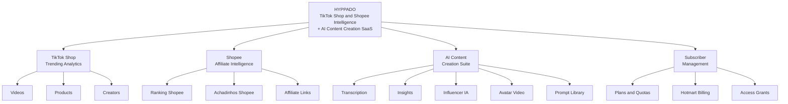

# Business Overview

> **Last updated**: 2026-08-06 (refresh — adds the Shopee vertical introduced in PR #101)

## Business Context Diagram



### Text Alternative

```
HYPPADO — TikTok Shop and Shopee Intelligence + AI Content Creation SaaS
  |
  +-- TikTok Shop Trending Analytics
  |     +-- Videos
  |     +-- Products
  |     +-- Creators
  |
  +-- Shopee Affiliate Intelligence          (NEW — 2026-07/08)
  |     +-- Ranking Shopee
  |     +-- Achadinhos Shopee
  |     +-- Affiliate Links
  |
  +-- AI Content Creation Suite
  |     +-- Transcription
  |     +-- Insights
  |     +-- Influencer IA
  |     +-- Avatar Video
  |     +-- Prompt Library
  |
  +-- Subscriber Management
        +-- Plans and Quotas
        +-- Hotmart Billing
        +-- Access Grants
```

## Business Description

**Business Description**: Hyppado is a B2C SaaS platform targeting Brazilian social-commerce content creators, marketers, and affiliate influencers. The platform aggregates trending intelligence from **two marketplaces** — TikTok Shop (via the EchoTik API) and **Shopee (via the Shopee Affiliate Open API)** — and pairs it with an AI-powered content creation suite. Users discover high-performing products and videos, obtain ready-to-use affiliate links, and generate sales-focused content for their own channels.

The Shopee vertical, added in July–August 2026, extends the original TikTok-only proposition into direct affiliate monetization: Hyppado not only tells the user *what* is selling, it hands them a Shopee affiliate link they can publish immediately.

**Business Transactions**:

1. **User Registration / Onboarding**: Admin creates a user (or user registers), receives a setup-password email, defines credentials on first login. Supports LGPD consent at login.

2. **Subscription Purchase (via Hotmart)**: User purchases a plan on Hotmart's checkout page. Hotmart sends a webhook event to Hyppado, which processes it, links the subscriber to the system user, and activates their subscription.

3. **Trending Video Discovery**: User browses the trending videos dashboard. Data was ingested from the EchoTik API by a cron job every 15 minutes. User can filter by country, category, and time range.

4. **Trending Product Discovery**: User browses trending products from TikTok Shop. Sees product ranking, commission rates, prices, and linked videos/influencers.

5. **Trending Creator Discovery**: User browses top TikTok Shop creators/influencers ranked by sales and GMV.

6. **Video Transcription**: User requests a transcript for a trending video. System downloads the video, sends it to OpenAI Whisper, and returns the full transcript. Transcript is shared/cached — one transcript per video for all users.

7. **AI Insight Generation**: User requests an AI insight for a video. System uses the existing transcript (or generates one) and sends it to an AI model (OpenAI/Google Gemini) which returns structured marketing analysis: hook, problem, solution, CTA, and reusable copy. Insight is private per user.

8. **Influencer IA Wizard**: User selects a trending product and goes through a guided wizard to generate influencer-style AI content: product image preparation, reference image upload, avatar-style video concept, hook text, copy, scenes, and VEO 3 video prompt.

9. **Avatar Video Creation**: Guided flow where user selects a product, an avatar profile (admin-managed), a scenario, then the system generates image variations and a VEO 3 prompt for video production.

10. **Prompt Library**: Admin curates a library of AI prompts. Users browse and copy prompts for content creation.

11. **Save & Organize**: Users save favorite videos/products, create named collections, and add notes to items.

12. **Alerts**: System or admin creates alerts for users about new products, trending creators, or high-ROAS opportunities.

13. **Support Request**: User submits a support email from within the app.

14. **Admin: User Management**: Admin views, creates, edits, and manages users — including granting manual access (bypassing subscription requirement).

15. **Admin: Financial Dashboard**: Admin views subscription metrics, revenue by month, and subscriber counts by plan.

16. **Admin: Webhook Event Monitoring**: Admin inspects incoming Hotmart webhook events, processing status, and errors. Admin notification center surfaces critical events.

17. **LGPD Compliance**: User can view, consent to, or withdraw consent for terms and privacy policy. User can request data erasure. Admin can process erasure requests.

18. **Shopee Ranking Discovery** *(new)*: User browses a best-seller ranking of Shopee products. A cron job queries the Shopee Affiliate GraphQL API across a fixed keyword basket (`RANKING_KEYWORDS`, 20 terms), consolidates and deduplicates results by `itemId`, ranks them by sales volume, and stores a full snapshot in `ShopeeProductTrend`. The user filters by category/subcategory and opens a details modal with price, commission, rating, shop, and the affiliate link.

19. **Achadinhos Shopee Discovery** *(new)*: User browses a feed of real TikTok videos tagged `#achadinhosshopee`, each already matched to a purchasable Shopee product with an affiliate link. Cards show views, sales, price, commission, the transcript, and an embedded TikTok player.

20. **Achadinhos AI Ingestion Pipeline** *(new, background)*: A cron job runs the full discovery chain — EchoTik hashtag video list (safe pagination, ≥30k-views relevance filter) → transcription (EchoTik native captions, falling back to OpenAI Whisper with fast-fail) → OpenAI GPT-4o-mini product-name extraction (strict `NULL` discard) → Shopee Affiliate `productOfferV2` search (sales > 0 and price > 0 filter) → affiliate short-link generation → persistence in `ShopeeAchadinhoProduct` with status `PENDING` for admin review.

21. **Admin: Shopee Configuration** *(new)*: Admin stores Shopee Affiliate credentials (App ID and API Secret, encrypted at rest), and tunes the ranking limit, ranking frequency, achadinhos frequency, achadinhos batch size (20–400), and the EchoTik hashtag ID used for discovery.

22. **Admin: Affiliate Link Override** *(new)*: Admin edits the affiliate link of a specific achadinho directly from the card. The system preserves the machine-generated link in `originalAffLink` on the first override, so the automated value is never lost.

**Business Dictionary**:

| Term | Meaning |
|---|---|
| EchoTik | Third-party SaaS that aggregates TikTok Shop analytics (videos, products, creators, hashtag video lists, native captions) |
| Hotmart | Brazilian digital product marketplace and payment platform used for subscription billing |
| Insight | AI-generated structured marketing analysis of a TikTok video |
| Transcript | Full text transcription of a TikTok video audio track |
| Influencer IA | AI wizard that generates influencer-style video scripts and visual concepts |
| Avatar Video | Guided flow for creating AI-driven product showcase videos using avatar profiles |
| GMV | Gross Merchandise Value — total sales revenue from a creator or product |
| ROAS | Return on Ad Spend — metric for affiliate marketing efficiency |
| LGPD | Lei Geral de Proteção de Dados — Brazilian data protection law (equivalent to GDPR) |
| Quota | Per-user monthly limit on feature usage (transcripts, insights, avatar videos, scripts) |
| AccessGrant | Admin-created override that grants a user platform access independently of subscription status |
| Plan | Subscription tier defining feature limits/quotas |
| Subscriber | A user who has an active Hotmart subscription |
| VEO 3 | Google's video generation AI model used to produce avatar videos from text prompts |
| **Shopee Affiliate API** | Shopee's GraphQL Open API (`open-api.affiliate.shopee.com.br/graphql`) used for product search and affiliate short-link generation |
| **Achadinho** | Portuguese for "little find" — a bargain product surfaced by a TikTok creator; here, a TikTok video already matched to a purchasable Shopee product |
| **Ranking Shopee** | Best-seller ranking of Shopee products, rebuilt from scratch on every sync |
| **Affiliate Link** | Monetized Shopee product URL (`shope.ee/...` short link) attributed to Hyppado via the `hyppado_achadinhos` sub-ID |
| **`originalAffLink`** | The machine-generated affiliate link, preserved when an admin manually overrides the visible link |
| **Relevance threshold** | Minimum 30,000 views a TikTok video must have to enter the achadinhos pipeline |
| **Risk Control** | EchoTik's rate-limiting/anti-abuse response (HTTP 500), mitigated by 20-item pages and ~2s delays |
| **Fast-fail** | Pipeline policy of abandoning a video immediately when a download or transcription is blocked, instead of waiting on long exponential backoff |

## Component Level Business Descriptions

### Trending Intelligence Module (TikTok Shop)
- **Purpose**: Surfaces what is trending on TikTok Shop right now so users can discover opportunities
- **Responsibilities**: Ingesting and displaying trending videos, products, and creators by country and category

### Shopee Intelligence Module *(new)*
- **Purpose**: Surfaces what is selling on Shopee and converts discovery directly into monetizable affiliate links
- **Responsibilities**:
  - Rebuilding the Shopee best-seller ranking from the Affiliate API on a scheduled cadence
  - Running the achadinhos AI pipeline (hashtag discovery → transcription → product extraction → Shopee match → affiliate link)
  - Serving both feeds to the dashboard with category filtering, sorting, and pagination
  - Giving admins credential management, tuning knobs, and manual affiliate-link override

### AI Content Suite
- **Purpose**: Turns trending data into actionable content for the user's own channel
- **Responsibilities**: Transcription, insight generation, influencer wizard, avatar video flow, prompt library. Since the Shopee release, the transcription layer is shared: `lib/transcription/media.ts` now also serves EchoTik native captions to the achadinhos pipeline.

### Subscription & Access Control
- **Purpose**: Manages which users have access to the platform and at what feature level
- **Responsibilities**: Hotmart integration, subscription lifecycle, plan quotas, manual access grants, LGPD

### Admin Panel
- **Purpose**: Operational control center for the platform team
- **Responsibilities**: User management, configuration, notification inbox, financial metrics, webhook monitoring, and Shopee configuration/curation
