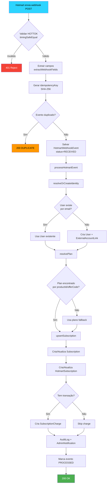
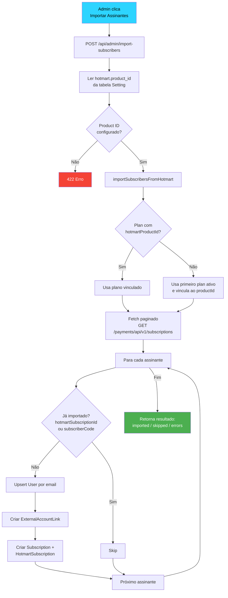
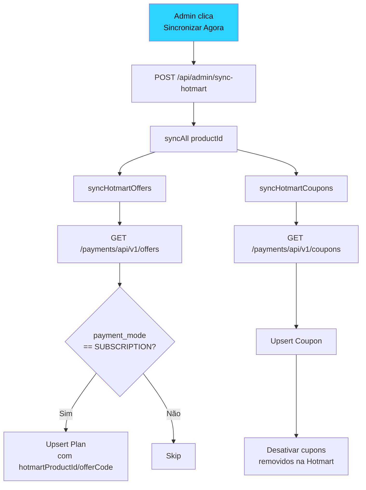
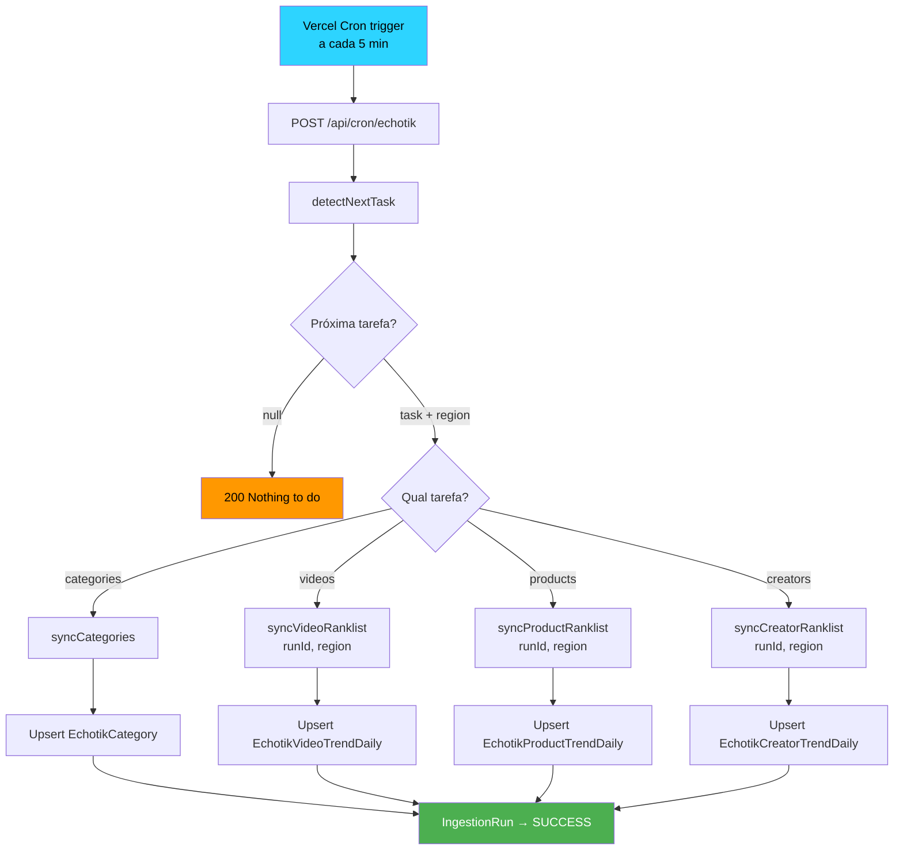
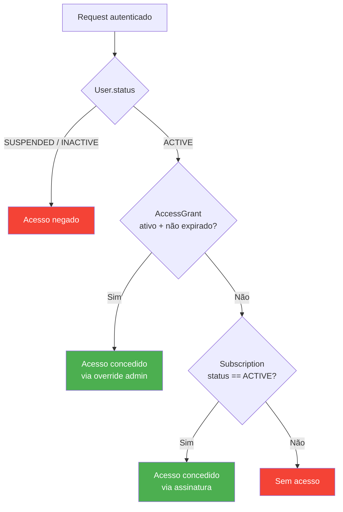
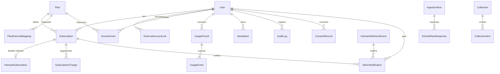

# Hyppado — Desenho do Banco de Dados

> Referência técnica do esquema PostgreSQL (Prisma). Última atualização: Março 2026.

---

## Visão Geral

O banco é dividido em **5 domínios** principais:

| Domínio               | Responsabilidade                      | Tabelas Principais                                                                                                          |
| --------------------- | ------------------------------------- | --------------------------------------------------------------------------------------------------------------------------- |
| **Identidade**        | Usuários, autenticação, LGPD          | `User`, `ConsentRecord`, `DataErasureRequest`                                                                               |
| **Comercial**         | Planos, assinaturas, pagamentos       | `Plan`, `Subscription`, `HotmartSubscription`, `SubscriptionCharge`, `Coupon`                                               |
| **Vínculos Externos** | Integração com providers              | `ExternalAccountLink`, `PlanExternalMapping`, `HotmartWebhookEvent`                                                         |
| **Dados TikTok**      | Trends de vídeos, produtos, criadores | `EchotikVideoTrendDaily`, `EchotikProductTrendDaily`, `EchotikCreatorTrendDaily`, `EchotikCategory`, `EchotikProductDetail` |
| **Operacional**       | Config, audit, uso, notificações      | `Setting`, `AuditLog`, `UsagePeriod`, `UsageEvent`, `AdminNotification`, `IngestionRun`, `Region`                           |

---

## Domínio 1 — Identidade do Sistema

O `User` é a entidade central. Nenhum campo de billing externo é obrigatório — o usuário existe de forma autônoma.

### User

| Campo           | Tipo                                | Descrição                     |
| --------------- | ----------------------------------- | ----------------------------- |
| `id`            | UUID                                | PK                            |
| `email`         | String (unique)                     | Email de login                |
| `passwordHash`  | String?                             | bcrypt hash                   |
| `role`          | `ADMIN` / `USER`                    | Controle de acesso            |
| `status`        | `ACTIVE` / `INACTIVE` / `SUSPENDED` | Bloqueio de acesso            |
| `lgpdConsentAt` | DateTime?                           | Último consentimento LGPD     |
| `deletedAt`     | DateTime?                           | Soft delete para anonimização |

### ConsentRecord (append-only)

Registro imutável de cada consentimento dado ou revogado. Campos: `consentType`, `version`, `granted`, `ipAddress`.

### DataErasureRequest

Solicitações LGPD de exclusão de dados. Status: `PENDING` → `IN_PROGRESS` → `COMPLETED` / `REJECTED`.

---

## Domínio 2 — Comercial (Planos, Assinaturas, Pagamentos)

### Plan

Planos de assinatura com quotas de uso.

| Campo                 | Tipo                 | Descrição                           |
| --------------------- | -------------------- | ----------------------------------- |
| `code`                | String (unique)      | Slug: `pro_mensal`, `premium_anual` |
| `priceAmount`         | Int                  | Preço em centavos (5990 = R$59,90)  |
| `periodicity`         | `MONTHLY` / `ANNUAL` | Ciclo de cobrança                   |
| `transcriptsPerMonth` | Int                  | Quota de transcrições               |
| `scriptsPerMonth`     | Int                  | Quota de scripts                    |
| `hotmartProductId`    | String?              | Link legado com produto Hotmart     |

### Subscription (origin-agnostic)

Uma assinatura pertence a um `User` e referencia um `Plan`. O campo `source` identifica a origem.

| Campo                   | Tipo      | Descrição                                                   |
| ----------------------- | --------- | ----------------------------------------------------------- |
| `userId`                | FK → User | Dono da assinatura                                          |
| `planId`                | FK → Plan | Plano vinculado                                             |
| `status`                | Enum      | `PENDING` / `ACTIVE` / `PAST_DUE` / `CANCELLED` / `EXPIRED` |
| `source`                | String    | `hotmart` / `manual` / `invite` / `stripe`                  |
| `startedAt` / `endedAt` | DateTime? | Período ativo                                               |
| `nextChargeAt`          | DateTime? | Próxima cobrança                                            |

### HotmartSubscription

Detalhe específico do Hotmart vinculado 1:1 à `Subscription`.

| Campo                   | Tipo                       | Descrição                     |
| ----------------------- | -------------------------- | ----------------------------- |
| `subscriptionId`        | FK → Subscription (unique) | Vínculo 1:1                   |
| `hotmartSubscriptionId` | String (unique)            | ID da assinatura na Hotmart   |
| `subscriberCode`        | String? (unique)           | Código do assinante           |
| `buyerEmail`            | String?                    | Email do comprador no Hotmart |
| `externalStatus`        | String?                    | Status raw da Hotmart         |

### SubscriptionCharge

Pagamentos e tentativas por assinatura.

| Campo           | Tipo             | Descrição                                                               |
| --------------- | ---------------- | ----------------------------------------------------------------------- |
| `transactionId` | String? (unique) | ID da transação Hotmart                                                 |
| `amountCents`   | Int?             | Valor em centavos                                                       |
| `status`        | Enum             | `PENDING` / `PAID` / `REFUNDED` / `CANCELLED` / `CHARGEBACK` / `FAILED` |

### Coupon

Cupons sincronizados da API Hotmart.

---

## Domínio 3 — Vínculos Externos

### ExternalAccountLink

Vincula um `User` a uma identidade em um provider externo (Hotmart, Stripe, etc). Um User pode ter 0 ou N vínculos.

| Campo                | Tipo    | Descrição                                            |
| -------------------- | ------- | ---------------------------------------------------- |
| `provider`           | String  | `hotmart`, `stripe`, etc.                            |
| `externalCustomerId` | String? | subscriberCode, stripeCustomerId                     |
| `externalEmail`      | String? | Email no provider (pode diferir do email do sistema) |
| `linkConfidence`     | String  | `auto_email` / `manual` / `admin` / `reconciliation` |
| `linkMethod`         | String  | `webhook` / `sync` / `manual` / `invite` / `import`  |

**Unique constraint:** `[provider, externalCustomerId]`.
**Index (lookup only):** `[provider, externalEmail]` — email é mutável, não serve como unique.

### PlanExternalMapping

Mapeia planos internos a IDs de provedores externos. Permite múltiplos providers sem poluir a tabela `Plan`.

### HotmartWebhookEvent

Registro completo de cada evento recebido via webhook Hotmart. Idempotência via SHA-256. Status de processamento: `RECEIVED` → `PROCESSING` → `PROCESSED` / `FAILED` / `DUPLICATE`.

---

## Domínio 4 — Dados TikTok (Echotik)

Snapshots diários de rankings do TikTok Shop, ingeridos por cron.

| Tabela                     | O que armazena                         | Chave única                                                   |
| -------------------------- | -------------------------------------- | ------------------------------------------------------------- |
| `EchotikVideoTrendDaily`   | Vídeos trending (views, sales, GMV)    | `[videoExternalId, date, country, rankingCycle, rankField]`   |
| `EchotikProductTrendDaily` | Produtos trending (vendas, GMV, preço) | `[productExternalId, date, country, rankingCycle, rankField]` |
| `EchotikCreatorTrendDaily` | Criadores trending (followers, vendas) | `[userExternalId, date, country, rankingCycle, rankField]`    |
| `EchotikCategory`          | Categorias L1 do TikTok Shop           | `externalId`                                                  |
| `EchotikProductDetail`     | Cache de detalhes de produto           | `productExternalId`                                           |
| `EchotikRawResponse`       | Payloads brutos (debug)                | `payloadHash` (SHA-256)                                       |

### IngestionRun

Controle de execuções do cron. Status: `RUNNING` → `SUCCESS` / `FAILED`.

### Region

Regiões/países disponíveis (BR, US, JP, etc). Controlado via admin — usada pelo cron e seletor da UI.

---

## Domínio 5 — Operacional

| Tabela                                        | Responsabilidade                                            |
| --------------------------------------------- | ----------------------------------------------------------- |
| `Setting`                                     | Configurações dinâmicas via admin (chave-valor)             |
| `AuditLog`                                    | Registro de ações relevantes (quem, o que, antes/depois)    |
| `UsagePeriod`                                 | Período mensal de uso por usuário                           |
| `UsageEvent`                                  | Evento atômico de consumo (idempotente)                     |
| `AccessGrant`                                 | Override manual de acesso concedido por admin               |
| `Invitation`                                  | Convites para novos usuários                                |
| `AdminNotification`                           | Alertas para o painel admin (dedup via SHA-256 `dedupeKey`) |
| `SavedItem` / `Collection` / `Note` / `Alert` | Dados do usuário na plataforma                              |

### AdminNotification (detalhes)

| Campo        | Tipo                     | Descrição                                                                |
| ------------ | ------------------------ | ------------------------------------------------------------------------ |
| `source`     | String (default hotmart) | Origem: `hotmart`, `system`, `cron`, `reconciliation`, `import`          |
| `type`       | String                   | Tipo: `SUBSCRIPTION_CHARGEBACK`, `WEBHOOK_INVALID`, `PROCESSING_FAILED`… |
| `severity`   | Enum                     | `INFO` / `WARNING` / `HIGH` / `CRITICAL`                                 |
| `dedupeKey`  | String? (unique)         | SHA-256 determinístico para dedup — null = sempre cria                   |
| `status`     | Enum                     | `UNREAD` / `READ` / `ARCHIVED`                                           |
| `readAt`     | DateTime?                | Timestamp de quando foi marcada como lida                                |
| `archivedAt` | DateTime?                | Timestamp de quando foi arquivada                                        |
| `resolvedAt` | DateTime?                | Timestamp de resolução pelo admin                                        |
| `resolvedBy` | String?                  | userId do admin que resolveu                                             |

---

## Cadeia de Acesso (Access Chain)

```
1. User.status == SUSPENDED/INACTIVE → bloqueia
2. AccessGrant ativo e não expirado → concede acesso (override)
3. Subscription ACTIVE vinculada → concede acesso
4. Fallback → sem acesso
```

---

## Fluxograma — Webhook Hotmart → Assinatura



---

## Fluxograma — Import de Assinantes (Admin)



---

## Fluxograma — Sync de Planos e Cupons



---

## Fluxograma — Cron Echotik (Ingestão de Dados)



---

## Fluxograma — Cadeia de Acesso do Usuário



---

## Diagrama ER Simplificado



---

## Notas Técnicas

- **IDs**: Todos UUID v4, exceto `Region.code` (string curta: "BR", "US") e `Setting.key` (chave textual).
- **Idempotência**: Webhook via SHA-256 (`idempotencyKey`), Usage via `UsageEvent.idempotencyKey`, Echotik via unique compostas por `[externalId, date, country, cycle, field]`.
- **Soft delete**: Apenas `User.deletedAt` para compliance LGPD.
- **Timestamps**: Todos os models têm `createdAt`; models mutáveis têm `updatedAt`.
- **BigInt**: Usado em métricas Echotik (views, likes, GMV) para suportar valores grandes.
- **Decimal**: Usado em `EchotikProductDetail` para preços com precisão.
